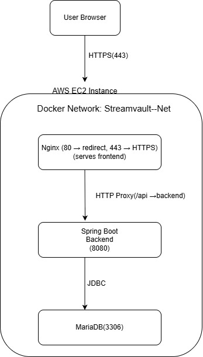

# Microblogging Platform – DevOps Deployment

Architecture

# **Explanation**

* Nginx serves the frontend static files (HTML, CSS, JavaScript).
* Requests to /api are forwarded by Nginx to the backend container.
* The Spring Boot backend handles business logic and communicates with MariaDB.
* All services run inside Docker containers on an AWS EC2 instance.

# **Tech Stack**

* **Backend:** Spring Boot (Java 21)
* **Frontend:** React (served by Nginx)
* **Database:** MariaDB
* **Containerization:** Docker & Docker Hub
* **CI/CD:** GitHub Actions
* **Cloud Hosting:** AWS EC2 (Ubuntu)
* **Reverse Proxy & Web Server:** Nginx
* **Security:** Let’s Encrypt (HTTPS)

# **CI/CD Flow**

The deployment pipeline runs automatically on every push to the main branch.

## Pipeline Steps

1. Code pushed to GitHub
2. GitHub Actions workflow starts
3. Maven builds and tests backend
4. Docker image is built
5. Image pushed to Docker Hub
6. EC2 server pulls latest image
7. Containers restart automatically

**Push → Build → Test → Docker Build → Push → Deploy on EC2**

#  **Application Deployment**

The application is deployed using prebuilt Docker images hosted on Docker Hub.

1. **Connect to EC2**
   ssh ubuntu@<EC2-PUBLIC-IP>
2. Pull Docker images
   docker pull Backend_Image_Name:latest
   docker pull Nginx_Image_Name:latest
   docker pull mariadb:11

3. **Create Docker network**
   docker network create Network_Name
4. **Start database container**
   docker run -d \
   --name mariadb \
   --network Network_Name \
   -e MARIADB_ROOT_PASSWORD=DB_ROOT_PASSWORD\
   -e MARIADB_DATABASE=DB_NAME\
   -e MARIADB_USER=DB_USER \
   -e MARIADB_PASSWORD=DB_PASSWORD \
   mariadb:11

5. **Start Spring Boot backend**
   docker run -d \
   --name Backend_Container_Name \
   --network Network_Name \
   -e SPRING_DATASOURCE_URL=jdbc:mariadb://mariadb:3306/DB_NAME \
   -e SPRING_DATASOURCE_USERNAME=DB_USER \
   -e SPRING_DATASOURCE_PASSWORD=DB_PASSWORD \
   brb46896/blogging-app:latest
6. **Start Nginx reverse proxy**
   docker run -d \
   --name Nginx_Container_Name \
   --network Network_Name \
   -p 80:80 -p 443:443 \
   Backend_Image_Name:latest

4. **Nginx Reverse Proxy**

Nginx handles incoming traffic:

/        → Frontend static files
/api     → Spring Boot backend container

This hides internal ports and exposes a single public entry point.

5. **HTTPS Configuration**

* Install Certbot:
* sudo apt install certbot python3-certbot-nginx -y
* Generate SSL certificate:
* sudo certbot --nginx -d your-domain.com
* HTTPS certificates renew automatically.

# **Key Decisions**

* Used Docker Compose to orchestrate backend and database containers.
* Served frontend directly through Nginx for simpler production deployment.
* Implemented reverse proxy routing to separate UI and API traffic.
* Automated builds and deployments using GitHub Actions.
* Enabled HTTPS using Let’s Encrypt for secure communication.

# **What This Project Demonstrates**

This project showcases practical experience with:

* Containerized deployments
* CI/CD automation
* Cloud infrastructure (AWS EC2)
* Reverse proxy configuration
* HTTPS/SSL setup

